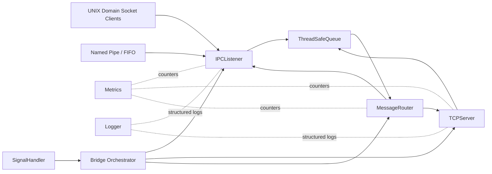

# ipc-socket-bridge

`ipc-socket-bridge` is a production-inspired C++17/Linux bridge that routes framed messages between local IPC transports and remote TCP clients. It models the kind of inter-module communication used in modular automotive infotainment, embedded Linux gateways, and telecom control-plane tools.

## Problem Statement

Linux products often split features into independent processes: a UI module, a hardware abstraction module, diagnostics, logging, and remote telemetry. Those modules need a reliable way to move small control messages across process and network boundaries without pulling in a heavy middleware stack. This repository demonstrates a compact bridge built with POSIX APIs, `epoll`, thread synchronization, RAII, and testable C++ components.

## Resume Mapping

This project maps directly to C++ system software work involving Linux/UNIX development, IPC, TCP/IP socket programming, multithreading, mutexes, condition variables, CMake, Git, GTest, GDB, Valgrind, and performance-aware design. It is suitable portfolio evidence for automotive suppliers and system software teams such as KPIT, Harman, Bosch, Continental, Qualcomm, Siemens, Nokia, Cisco, Luxoft, Samsung, Intel, Ericsson, and Tech Mahindra.

## Features

- UNIX domain socket listener for local IPC producers.
- Named FIFO listener as an alternative IPC transport.
- TCP server for remote consumers/producers.
- `epoll`-based non-blocking I/O multiplexing.
- Bidirectional framed routing between IPC and TCP endpoints.
- Thread-safe bounded producer/consumer queue.
- Key-value configuration file parser.
- Reconnecting TCP example client with exponential backoff.
- Graceful shutdown on `SIGTERM` and `SIGINT`; `SIGPIPE` ignored.
- Thread-safe structured logger with timestamps and levels.
- Runtime metrics for routed messages, bytes, connections, uptime, and errors.
- RAII cleanup of sockets, FIFOs, threads, and signal handlers.
- Unit and integration tests using Google Test.

## Architecture

```text
  IPC processes                 Bridge process                    Remote clients
+----------------+       +-------------------------+       +---------------------+
| UNIX socket    | ----> | IPCListener             |       | TCP client receiver |
| FIFO producer  | ----> | ThreadSafeQueue         | ----> | TCP diagnostics     |
+----------------+       | MessageRouter           |       +---------------------+
                         | TCPServer               |
                         | Metrics + Logger        |
                         +-------------------------+
```



## Build

```bash
sudo apt-get update
sudo apt-get install -y cmake g++ libgtest-dev
./scripts/build.sh
```

Run tests:

```bash
./scripts/run_tests.sh
```

## Usage

Terminal 1:

```bash
./build/ipc-socket-bridge configs/bridge_config.cfg
```

Terminal 2:

```bash
./build/examples/tcp_client_receiver 127.0.0.1 9090
```

Terminal 3:

```bash
./scripts/send_test_message.sh /tmp/ipc_socket_bridge.sock "hvac:set_temp=22"
```

## Configuration

`configs/bridge_config.cfg` uses `key=value` entries:

| Key | Purpose |
| --- | --- |
| `unix_socket_path` | Filesystem path for the UNIX domain socket. |
| `fifo_path` | Filesystem path for the named pipe. |
| `tcp_bind_address` | IPv4 address to bind the TCP server. |
| `tcp_port` | TCP listening port. |
| `queue_capacity` | Bounded message queue capacity. |
| `max_payload_bytes` | Maximum accepted frame payload. |
| `epoll_timeout_ms` | Event loop timeout. |
| `reconnect_initial_delay_ms` | Initial delay used by reconnecting clients. |
| `reconnect_max_delay_ms` | Maximum reconnect delay. |
| `log_file` | Log file path. |
| `log_level` | `debug`, `info`, `warn`, or `error`. |
| `log_console` | Enable console logs. |
| `enable_fifo` | Enable FIFO listener. |
| `enable_unix_socket` | Enable UNIX socket listener. |

## Wire Protocol

Each message uses a fixed 16-byte header followed by payload bytes.

| Offset | Size | Field |
| --- | --- | --- |
| 0 | 4 | Magic `0x49504342` (`IPCB`) |
| 4 | 2 | Version, currently `1` |
| 6 | 1 | Source endpoint: `1` IPC, `2` TCP |
| 7 | 1 | Destination endpoint: `1` IPC, `2` TCP |
| 8 | 4 | Sequence number |
| 12 | 4 | Payload size |
| 16 | N | Payload |

All multi-byte fields are network byte order.

## Debugging With GDB

```bash
cmake -S . -B build -DCMAKE_BUILD_TYPE=Debug
cmake --build build
gdb --args ./build/ipc-socket-bridge configs/bridge_config.cfg
```

Useful breakpoints: `bridge::MessageRouter::run`, `bridge::TCPServer::run`, and `bridge::IPCListener::run`.

## Valgrind

```bash
sudo apt-get install -y valgrind
./scripts/run_valgrind.sh
```

The bridge owns descriptors and threads through destructors, so Valgrind should report no reachable leaks from bridge-owned resources after a clean shutdown.

## Performance Notes

The design avoids one thread per client. TCP and IPC descriptors are multiplexed through `epoll`, and work is handed to a bounded queue to apply backpressure. Payload copies are limited to frame assembly and routing boundaries. Runtime metrics make it easy to compare message volume and byte throughput during load tests.

## Recruiter Notes

This project demonstrates the core skills expected from a C++ Linux system software engineer: POSIX sockets, UNIX IPC, non-blocking I/O, synchronization, RAII, CMake, automated testing, CI, and operational documentation. The automotive infotainment framing mirrors practical work such as HVAC control messages moving between UI, middleware, and diagnostics modules.

## GitHub Metadata

Short description:

`Production-inspired C++17 Linux IPC-to-TCP bridge using UNIX sockets, FIFO, epoll, multithreading, GTest, and CMake.`

Suggested topics:

`cpp17`, `linux`, `unix-sockets`, `tcp-ip`, `epoll`, `ipc`, `posix`, `multithreading`, `cmake`, `gtest`, `embedded-linux`, `automotive`, `systems-programming`

LinkedIn portfolio summary:

Built `ipc-socket-bridge`, a C++17/Linux system software project that routes framed messages between UNIX domain sockets, named pipes, and TCP clients using non-blocking `epoll`, thread-safe queues, graceful POSIX signal handling, runtime metrics, GTest coverage, and GitHub Actions CI. The project reflects production-style automotive infotainment communication patterns similar to HVAC control and diagnostics modules.
