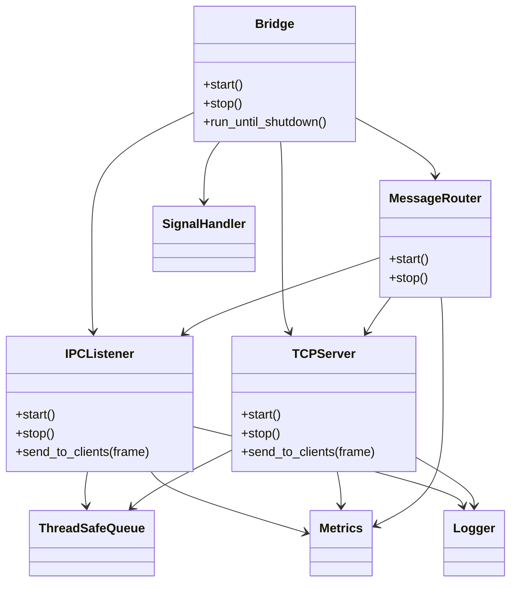

# Architecture

`ipc-socket-bridge` is organized around small ownership-focused components.

## Data Flow

1. A local module connects through a UNIX domain socket or writes to the FIFO.
2. The IPC listener reads non-blocking data with `epoll`.
3. Complete wire frames are pushed into `ThreadSafeQueue<RoutedMessage>`.
4. `MessageRouter` consumes messages and forwards IPC-origin frames to TCP clients.
5. TCP-origin frames follow the reverse path and are sent to IPC clients.
6. Metrics and structured logs record routing activity and error conditions.

## Ownership

`Bridge` owns the listeners, router, queue, metrics, and signal handler. Listeners own their descriptors and close them during `stop()` and destruction. The router closes the queue during shutdown to unblock consumers. Signal handling is scoped through `SignalHandler`, which restores previous handlers in its destructor.

## Linux Design Choices

The repository intentionally uses Linux/POSIX primitives instead of framework abstractions. `epoll` provides scalable readiness notification, `AF_UNIX` supports low-latency local process communication, FIFOs support shell-friendly integration, and TCP exposes the same framed protocol to remote diagnostics or gateway clients.
